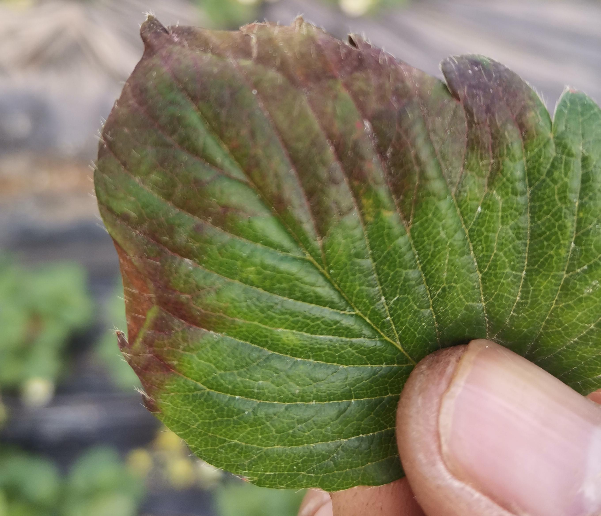

# Classification-of-strawberry-pests-and-diseases

## 本项目使用深度学习模型对草莓病虫害疾病进行识别

## 项目部分代码参考地址

<https://github.com/WZMIAOMIAO/deep-learning-for-image-processing>

## 环境配置

* Python 3.8
* Pytorch 1.10.1
* Ubuntu
* AutoGluon 0.4.0
* TensorFlow 2.7

## 文件结构：
```
  ├── swin_Transformer:手动调参的swin Transformer模型代码（TensorFlow）
  ├── Vision_Transformer:手动调参的Vision Transformer模型代码（TensorFlow）
  ├── data_processing:对爬虫下来的图片进行处理的代码
  ├── AutoGluon.ipynb:自动调参的模型代码
  ├── AutoGluon.ipynb:自动调参的模型代码
  └── CNN_Model.ipynb:ResNet50、VGG、Googlenet模型的手动调参代码（Keras）
```

## 使用的模型

1. Vision Transformer

2. Swin Transformer

3. Resnet50

4. GoogleNet

5. VGG19

6. VGG16

## 数据来源

通过爬虫爬取各大农业咨询网站数据，获得**32**种不同的草莓病虫害的图像数据。
<!--   -->
 

## 不同模型精度对比

|模型|调参方法|精度|
|:------:|:------:|:------:|
|Vision Transformer|AutoGluon自动调参|90.7%|
|Swin Transformer|AutoGluon自动调参|80.3%|
|Resnet50|AutoGluon自动调参|78.56%|
|VGG19|AutoGluon自动调参|74.25%|
|VGG16|AutoGluon自动调参|75.07%|
|Vision Transformer|手动调参|71.7%|
|Swin Transformer|手动调参|70.3%|
|Resnet50|手动调参|65.16%|
|VGG19|手动调参|64.32%|
|VGG16|手动调参|65.14%|

## 精度最高的模型训练策略

1. 使用大数据集进行预训练
2. 在精选数据集上再进行训练

